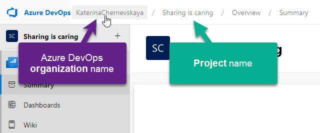

# ALM Space Explorer: Workshop Prerequisites

Welcome to the initial step of your ALM adventure! Before we dive deep into the engaging hands-on labs, it is imperative to ensure that all the prerequisites are adequately met. This article guides you to check and set up the necessary environments and tools. Let's ensure that your spaceship is ready for the expedition!

## 1. Laptop
**Task:** Ensure you have a laptop with sufficient charge and functioning properly.

**Outcome:** A reliable device to sail through the various hands-on labs smoothly without any hitches.

***

## 2. Tenant with Microsoft 365 subscription
**Task:** Ensure that you have an active tenant with a Microsoft 365 subscription.

:exclamation: _Note:
Your Microsoft 365 subscription could be a trial version, but not Microsoft 365 Developer. Start your trial [here](https://signup.microsoft.com/get-started/signup?products=91dcd8b1-3b1b-444d-9cdb-0bc0da3eb40d&mproducts=CFQ7TTC0LH18:0002&fmproducts=CFQ7TTC0LH18:0002&culture=en-us&country=us&ali=1) and kick-off with a fresh new tenant._

**Outcome:** A secure foundation to build and deploy your solutions effectively using the Power Platform.

***

## 3. Ensure Assigned Roles
**Task:** Verify that your account has been granted both the `Power Platform Administrator` and `Application Administrator` roles in your tenant. These roles will empower you with the necessary permissions to carry out various operations seamlessly throughout the workshop.

:exclamation: _Note:
Having these roles assigned to your account ensures you can manage all settings and features without any restriction, offering a smooth and friction-free workshop experience._

**Outcome:** A fully equipped account with the vital privileges to explore and harness the complete potential of the Power Platform and related services during the labs.

**Checking path:**
1. Navigate to [https://admin.microsoft.com/](https://admin.microsoft.com/).
2. In the `Users` section click on `Active users`. Find your account and click on the name.
3. In the opened page check that both `Power Platform Administrator` and `Application Administrator` roles has been granted for your account.

***

## 4. Power Apps Developer Plan Activated in your tenant
**Task:** Make sure that the Power Apps Developer Plan is started in your tenant, granting you access to a suite of Microsoft Power Platform functionalities.

:exclamation: _Note:
Start your Power Apps Developer Plan [here](https://powerapps.microsoft.com/en-us/developerplan/)._

**Outcome:** An activated developer plan enabling you to explore and utilize a rich set of features in Power Apps.

***

## 5. Azure DevOps Organization in your tenant
**Task:** Ensure that you have an Azure DevOps Organization created in your tenant, setting the stage for a seamless ALM workshop experience.

:exclamation: _Note:
You can start for free and create an Azure DevOps Organization [here](https://dev.azure.com/)._

**Outcome:** A ready-to-use Azure DevOps Organization to facilitate smooth workflows during the workshop.

***

## 6. Enable Free Tier for Parallelism in Azure DevOps Organization
**Task:** Ensure that the free tier for parallelism is enabled in your Azure DevOps Organization to support concurrent operations, enhancing efficiency.

:exclamation: _Note:
Request free tier of Parallelism for your Azure DevOps Organization through [this](https://forms.office.com/pages/responsepage.aspx?id=v4j5cvGGr0GRqy180BHbR63mUWPlq7NEsFZhkyH8jChUMlM3QzdDMFZOMkVBWU5BWFM3SDI2QlRBSC4u) form. The free tier for parallelism typically requires a 2-day approval._

**Outcome:** An optimized Azure DevOps setup, allowing for parallel operations to execute pipelines.

**Navigating the Setup of Your Azure DevOps Organization**
Follow the below steps to set your Azure DevOps organization prepared in advance to make the most of our workshop.

1. Go to https://dev.azure.com/
2. Complete the project creation form and click `Continue`
3. Once the project will be created, navigate to the [Azure DevOps Parallelism Request form](https://forms.office.com/pages/responsepage.aspx?id=v4j5cvGGr0GRqy180BHbR63mUWPlq7NEsFZhkyH8jChUMlM3QzdDMFZOMkVBWU5BWFM3SDI2QlRBSC4u), answer the four provided questions and then submit the form.
- in the question `What is your name?` write your name
- in the question `What is your email address?` write your email address from the tenant for which you make the request
- in the question `What is the name of your Azure DevOps Organization?` write the link to your Azure DevOps organizatopn (like https://dev.azure.com/KaterinaChernevskaya)
_To locate this link, click on the organization name associated with your newly created project and copy the URL from the address bar._

- in the question `Are you requesting a parallelism increase for Public or Private projects?` select `Private`

***

## 7. (optional) Visual Studio Code installed
**Task:** Make sure to have Visual Studio Code installed on your laptop. If you don't have it installed and wish to complete the Lab which covers automating updates for environment variables and connection references, you can download it using [this link](https://code.visualstudio.com/).

**Outcome:** You will be prepared to carry out the necessary steps for a smooth deployment process.

***

